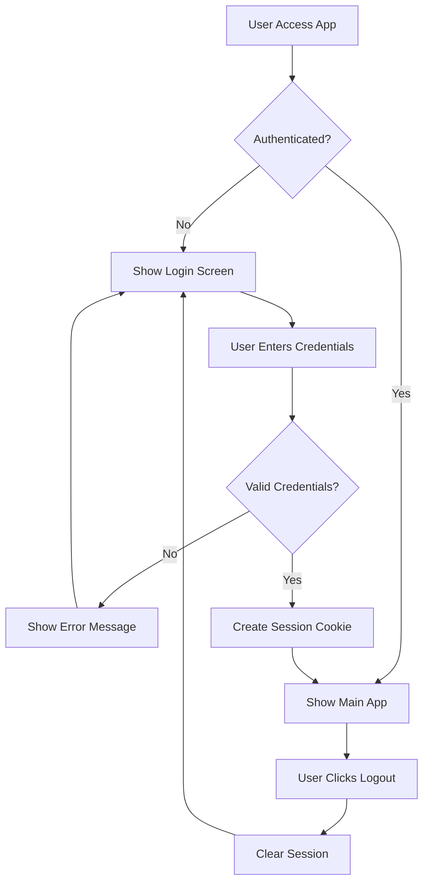

# Design Document

## Overview

This design implements secure username/password authentication for the existing Kitchen Intel Streamlit application using the streamlit-authenticator library. The authentication system will act as a gateway, requiring users to login before accessing the main application functionality. The design maintains the existing application structure while adding a security layer that manages user sessions through encrypted cookies.

## Architecture

The authentication system follows a layered approach:

1. **Authentication Layer**: Handles login/logout functionality and session management
2. **Configuration Layer**: Manages user credentials and authentication settings via YAML
3. **Application Layer**: The existing Kitchen Intel functionality (protected content)
4. **Session Management**: Cookie-based session persistence

### Authentication Flow



## Components and Interfaces

### 1. Authentication Manager

**Purpose**: Central component that handles all authentication operations

**Key Methods**:
- `load_config()`: Loads credentials from YAML file
- `initialize_authenticator()`: Sets up streamlit-authenticator instance
- `handle_login()`: Processes login attempts and manages UI
- `handle_logout()`: Processes logout and session cleanup
- `check_authentication()`: Verifies current authentication status

### 2. Configuration Manager

**Purpose**: Manages loading and validation of authentication configuration

**Configuration Structure**:
```yaml
credentials:
  usernames:
    user1:
      name: "User One"
      email: "user1@example.com"
      password: "$2b$12$..." # bcrypt hashed password
    admin:
      name: "Administrator"
      email: "admin@example.com"
      password: "$2b$12$..." # bcrypt hashed password
cookie:
  expiry_days: 30
  key: "some_random_signature_key"
  name: "kitchen_intel_auth_cookie"
```

### 3. Application Wrapper

**Purpose**: Wraps the existing application logic to only display when authenticated

**Key Functions**:
- `render_authenticated_app()`: Renders the main Kitchen Intel application
- `render_login_screen()`: Renders the authentication interface
- `main()`: Main application entry point with authentication check

## Data Models

### User Credential Model
```python
@dataclass
class UserCredential:
    username: str
    name: str
    email: str
    hashed_password: str
```

### Authentication State Model
```python
@dataclass
class AuthenticationState:
    name: Optional[str]
    authentication_status: Optional[bool]
    username: Optional[str]
    is_authenticated: bool
```

### Cookie Configuration Model
```python
@dataclass
class CookieConfig:
    expiry_days: int
    key: str
    name: str
```

## Error Handling

### Authentication Errors
- **Invalid Credentials**: Display user-friendly error message without revealing whether username or password was incorrect
- **Missing Configuration**: Graceful fallback with clear error message for administrators
- **Corrupted Session**: Automatic session cleanup and redirect to login

### Configuration Errors
- **Missing YAML File**: Create default configuration template with instructions
- **Invalid YAML Format**: Detailed error message with line number and issue description
- **Missing Required Fields**: Validation with specific field requirements

### Session Management Errors
- **Expired Cookies**: Automatic cleanup and re-authentication prompt
- **Invalid Cookie Signature**: Security warning and forced re-authentication
- **Cookie Storage Issues**: Fallback to session-only authentication

## Testing Strategy

### Unit Tests
1. **Authentication Manager Tests**
   - Test credential validation with valid/invalid combinations
   - Test session creation and cleanup
   - Test configuration loading with various YAML formats

2. **Configuration Manager Tests**
   - Test YAML parsing with valid configurations
   - Test error handling for malformed YAML
   - Test password hashing validation

3. **Application Wrapper Tests**
   - Test authenticated vs unauthenticated rendering
   - Test logout functionality
   - Test session persistence across page refreshes

### Integration Tests
1. **End-to-End Authentication Flow**
   - Test complete login process from start to main app
   - Test logout and return to login screen
   - Test session persistence across browser refresh

2. **Security Tests**
   - Test password hashing security
   - Test session cookie security
   - Test protection against unauthorized access

### Manual Testing Scenarios
1. **User Experience Tests**
   - Login with valid credentials
   - Login with invalid credentials
   - Session timeout behavior
   - Logout functionality
   - Page refresh with active session

## Implementation Details

### File Structure
```
├── main.py (modified with authentication wrapper)
├── credentials.yaml (new - authentication configuration)
├── auth/
│   ├── __init__.py
│   ├── authentication_manager.py
│   └── config_manager.py
└── requirements.txt (updated with new dependencies)
```

### Dependencies to Add
- `streamlit-authenticator>=0.2.3`
- `PyYAML>=6.0`
- `bcrypt>=4.0.1` (for password hashing)

### Security Considerations
1. **Password Storage**: All passwords stored as bcrypt hashes
2. **Session Security**: Signed cookies with configurable expiration
3. **Configuration Security**: YAML file should be excluded from version control
4. **Error Messages**: Generic error messages to prevent username enumeration

### Integration with Existing App
The existing Kitchen Intel application code will be wrapped in an authentication check. The main application logic remains unchanged, but access is controlled through the authentication layer. This ensures minimal disruption to existing functionality while adding comprehensive security.