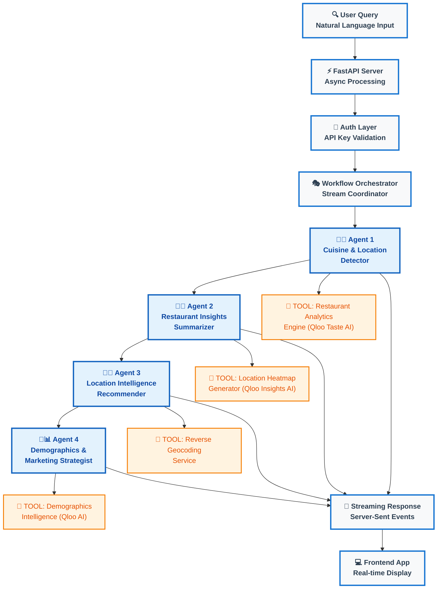
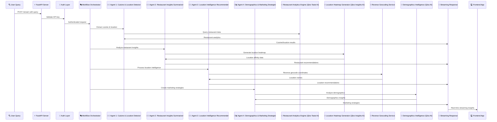

# 🍽️ Kitchen Intel Frontend App

A secure Streamlit frontend application that provides an intuitive interface for AI-powered restaurant business intelligence, helping prospective restaurant owners and food truck entrepreneurs make data-driven decisions through a user-friendly web interface.

## 🔗 Backend Application

This frontend pairs with our powerful AI-driven backend platform available at: [Kitchen Intel Backend](https://github.com/muralikrishnat290/cuisine-qloo)

## ⚠️ Prototype Notice

**This is a prototype frontend application** designed to demonstrate AI-powered restaurant insights capabilities through a web interface. Please note:

- **Simple Authentication**: Uses environment variable-based authentication for demonstration purposes
- **No User Database**: This prototype does not include user registration or profile management
- **Limited Security**: Missing enterprise-grade security features required for production deployment
- **Simplified Architecture**: Built for demonstration purposes, not production scalability

For production deployment, additional infrastructure including proper user management, enhanced authentication, and security hardening would be required.

## 🌟 Overview

Kitchen Intel Frontend is a Streamlit-based web application that serves as the user interface for comprehensive restaurant business intelligence. By connecting to our AI-powered backend that leverages **Qloo's advanced AI technology**, users can analyze cuisine trends, get location recommendations, and develop marketing strategies through an intuitive, secure web interface powered by **Qloo Taste AI** and **Qloo Insights AI**.

## 📋 Table of Contents

- [🏗️ Architecture Overview](#️-architecture-overview)
- [🔄 Workflow Process](#-workflow-process)
- [🤖 AI Agents Working Behind the Scenes](#-ai-agents-working-behind-the-scenes)
- [💡 Use Cases](#-use-cases)
- [🚀 Quick Start](#-quick-start)
- [🔐 Environment Variables](#-environment-variables)

## 🏗️ Architecture Overview

The frontend connects to a sophisticated backend system powered by multiple AI agents:



### 🎯 Qloo AI Integration Highlights

The architecture showcases **Qloo's AI technology** as the intelligence backbone of Kitchen Intel:

- **🏪 Qloo Taste AI**: Powers the Restaurant Analytics Engine, providing deep insights into food trends, dish popularity, and cuisine preferences with unmatched accuracy
- **🗺️ Qloo Insights AI**: Drives the Location Heatmap Generator, analyzing geographic data and location affinity patterns for optimal restaurant placement  
- **👥 Qloo AI**: Fuels the Demographics Intelligence tool, delivering sophisticated audience analysis and targeted marketing strategies

Each AI agent leverages these **Qloo-powered tools** to transform raw data into actionable business intelligence, making Kitchen Intel the most comprehensive restaurant planning platform available.

## 🔄 Workflow Process

The application follows a sophisticated 4-step workflow that processes user queries through specialized AI agents:



## 🤖 AI Agents Working Behind the Scenes

### 1. Cuisine & Location Detector Agent 🍠🌮
- **Purpose**: Extracts cuisine type and location from natural language queries
- **Output**: Structured data with detected cuisine and location
- **Technology**: Uses structured output parsing for precise data extraction

### 2. Restaurant Insights Summarizer 🍣🌯
- **Purpose**: Analyzes restaurant data and provides trending food recommendations
- **Features**: 
  - Identifies popular dishes in specific cuisines and locations
  - Correlates restaurant popularity with cuisine preferences
  - Provides actionable recommendations for menu planning
- **Output**: Concise summaries without revealing specific data points

### 3. Location Intelligence Recommender 🍴📍
- **Purpose**: Recommends optimal locations for restaurant establishment
- **Features**:
  - Analyzes location affinity data for specific cuisines
  - Provides geographic recommendations with popularity rankings
  - Integrates reverse geocoding for human-readable location names
- **Output**: Prioritized location recommendations

### 4. Demographics & Marketing Strategist 📢📊
- **Purpose**: Creates targeted marketing strategies based on demographic data
- **Features**:
  - Analyzes demographic patterns for cuisine preferences
  - Generates marketing ideas and promotional strategies
  - Provides audience-specific recommendations
- **Output**: Actionable marketing strategies and promotional ideas

## 💡 Use Cases

- **New Restaurant Planning**: Get comprehensive insights before opening
- **Food Truck Route Optimization**: Find the best locations for mobile food service
- **Menu Development**: Understand trending dishes and customer preferences
- **Marketing Strategy**: Develop targeted promotional campaigns
- **Competitive Analysis**: Understand the local restaurant landscape

## 🚀 Quick Start

1. **Set up authentication:**
   ```bash
   python3 setup_env_auth.py
   ```

2. **Set environment variables** (copy from setup script output)

3. **Run the application:**
   ```bash
   streamlit run main.py
   ```

4. **Login** with your credentials

## 🔐 Environment Variables

### Required Variables
```bash
AUTH_USERNAME=admin
AUTH_NAME=Administrator
AUTH_EMAIL=admin@example.com
AUTH_PASSWORD=$2b$12$your_bcrypt_hashed_password
API_URL=http://localhost:8080
API_KEY=your_api_key_here
```

### Optional Variables
```bash
# Cookie configuration (omit for session-only auth)
AUTH_COOKIE_NAME=kitchen_intel_auth_cookie
AUTH_COOKIE_KEY=your_secret_key_here
AUTH_COOKIE_EXPIRY=1

# Suppress warnings
PYTHONWARNINGS=ignore
```

---

**Simple. Secure. Environment Variables Only.** 🎯